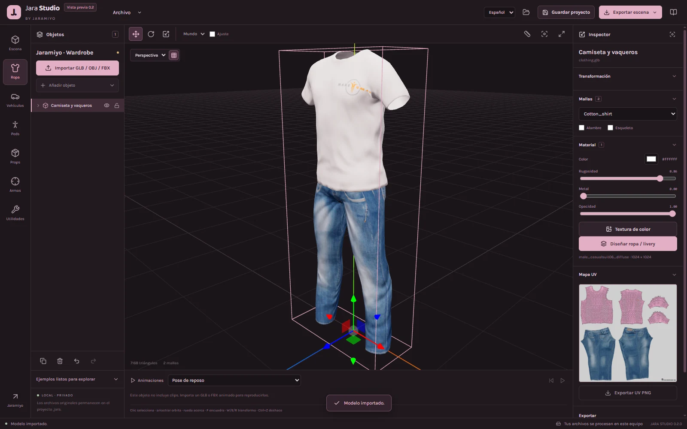
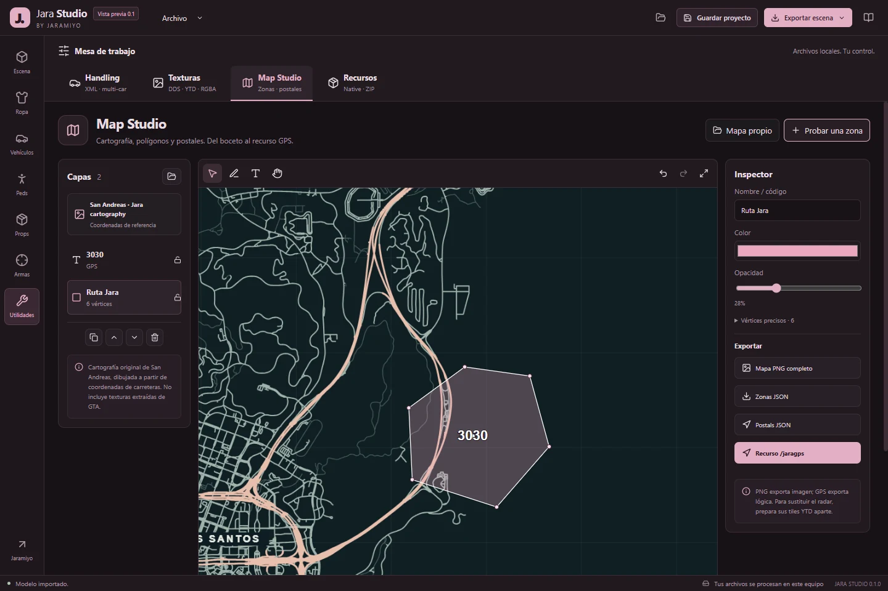

# Jara Studio

A local workspace by **Jaramiyo** for preparing 3D models and FiveM resources. Windows x64 installers, portable builds and source are published in [Releases](https://github.com/JaramiyoSM/jara-studio/releases).

[Español](docs/GUIA-ES.md) · [English](docs/GUIDE-EN.md) · [Jara-tools](https://jara-tools.vercel.app/#/desktop) · [Discord](https://discord.gg/TvDYptEDAj)



## What it does

- Import GLB, glTF, OBJ with MTL, FBX and STL into a scene with multiple objects.
- Select objects, move/rotate/scale with gizmos, snap, duplicate, hide, lock and undo edits.
- Inspect meshes, UVs, material slots and skeletons; assign textures and play imported animation clips.
- Save `.jara` projects with embedded scene data and original imports; restore local recovery saves.
- Export GLB, geometry/UV OBJ, viewport PNG and placement JSON.
- Prepare vehicle handling, inspect textures, validate resource files and edit minimap overlays in the utilities workspace.



Includes attributed CC0 examples of a rigged human, clothing, a vehicle, a prop and a stylized weapon. These are working-format examples, not native GTA assets.

## Scope

Jara Studio prepares models and resources. It does not replace Blender's mesh modeling, sculpting or retopology tools. It does not compile GLB into YDR/YDD/YFT, generate a compatible GTA skeleton or guarantee that arbitrary imported models work in FiveM. Use [Blender](https://www.blender.org/) with [Sollumz](https://github.com/Sollumz/Sollumz) for native model preparation and test finished resources in a real server.

Processing is local. No account, analytics, file upload or cloud service is required by this application. Website and community links open your browser when selected. The Jara-tools website is maintained separately; its private source is not included in this repository.

## Install

Download `Jara-Studio-0.1.0-Setup-x64.exe` for a per-user installation, or `Jara-Studio-0.1.0-Portable-x64.exe` to run without installation. Windows x64 is the packaged target. Compare the file with `SHA256SUMS.txt` in the same release.

The first release is **unsigned**: Windows can display an unknown-publisher warning. No publisher verification or code-signing certificate is claimed. Review the release, checksum and source before choosing to run it. Projects are saved where you choose; uninstalling does not delete them.

## Develop

Use Node.js 24 and npm:

```sh
npm ci
npm run dev
```

The browser preview runs at `http://127.0.0.1:5186`. Native file dialogs and persistent recovery are available in the Electron application:

```sh
npm test
npm run build
npm start
npm run package
```

Build outputs go to `release/`. The Windows workflow builds and tests the same source. Release publication is performed separately; build jobs have read-only repository permissions.

## Project and security design

`.jara` is a versioned ZIP archive containing a manifest, an embedded GLB scene and original imports. Project reads check paths, archive entry counts and uncompressed size before parsing. Renderer scripts cannot access Node.js or arbitrary filesystem paths. A sandboxed preload exposes only bounded file operations through native dialogs. Remote renderer requests, extra windows and browser permissions are blocked.

Import selections are limited to 128 files, 128 MiB per file and 256 MiB total. Large scenes may exceed available GPU memory before these limits. Save frequently and keep original files.

The scene loader applies a stricter 96 MiB model/dependency limit and five-million-vertex model limit. `.jara` projects cover the 3D scene; utility workspaces use their own separate exports.

The original-file pool is capped at 128 MiB/500 files, and the scene at 500 objects/ten million vertices. Closing warns about pending changes or open utility data. See [verification notes](docs/VERIFICATION.md) for test coverage and runtime limits. Release validation passed 41 tests; the installer and portable launcher are also exercised as actual Windows applications.

## License and credits

Application source: [MIT](LICENSE), copyright Jaramiyo. Included dependencies, fonts and example models retain their own licenses. See [THIRD_PARTY_NOTICES.txt](THIRD_PARTY_NOTICES.txt), `public/samples/samplecredits.json` and the adjacent sample license files. The texture codec is adapted from the MIT-licensed Jara Tools texture engine and keeps its attribution.
